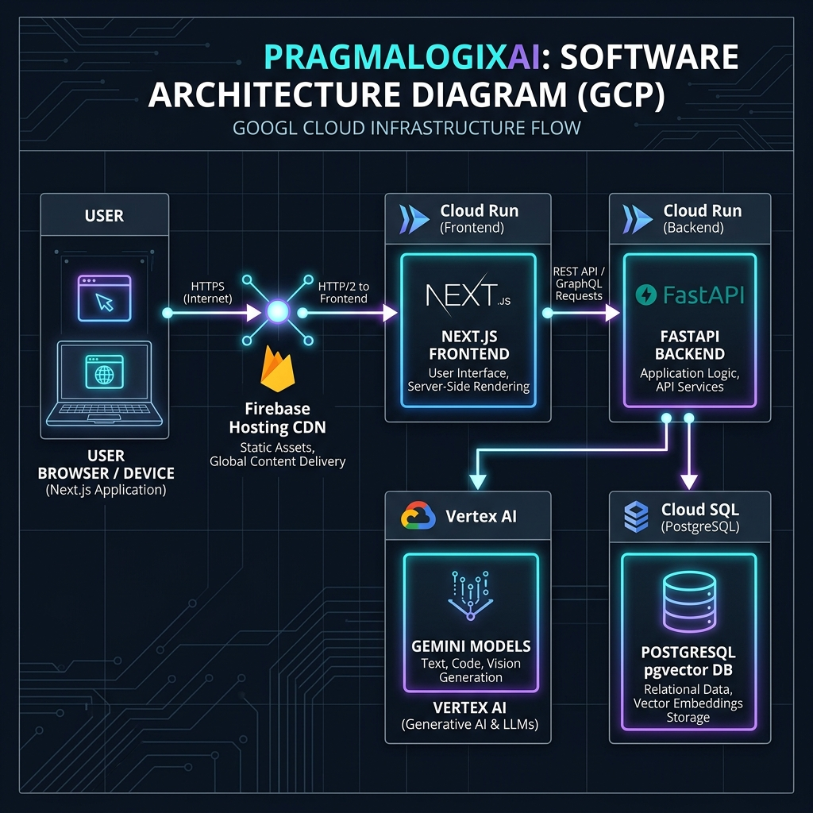
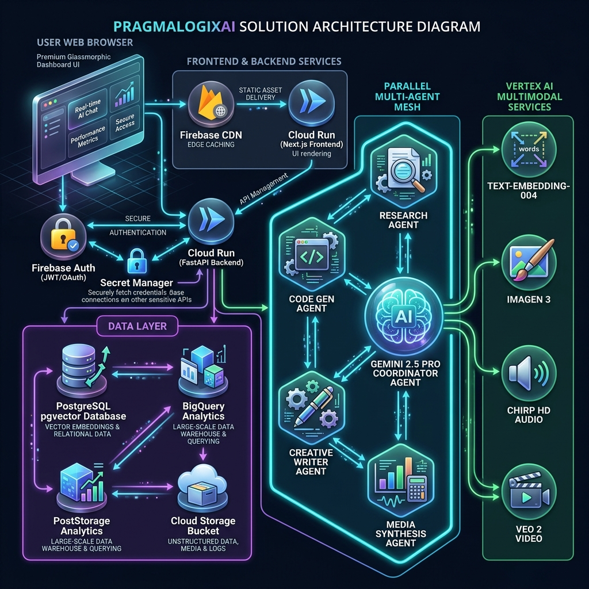
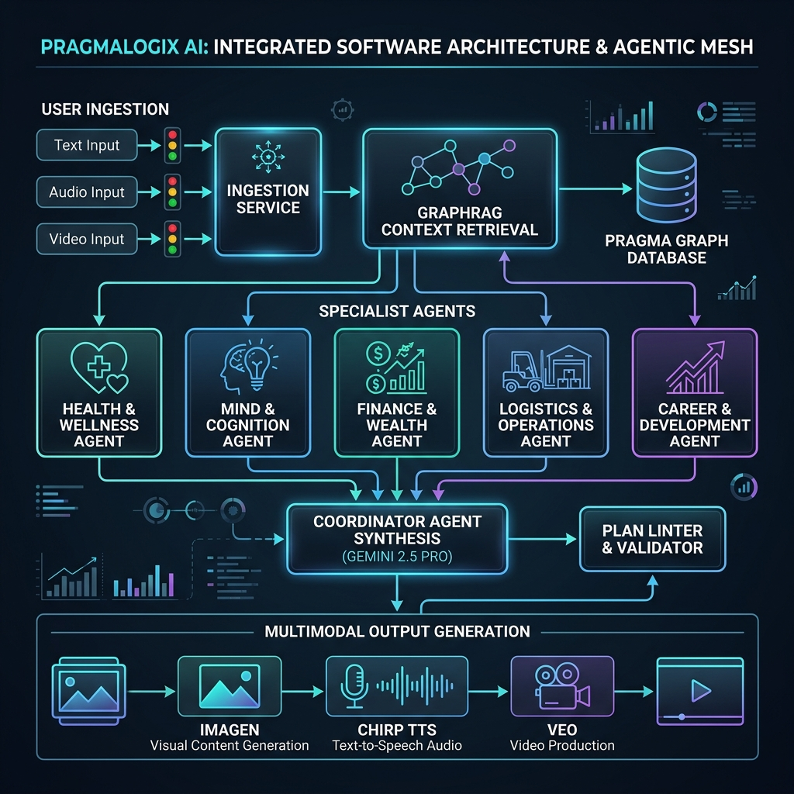
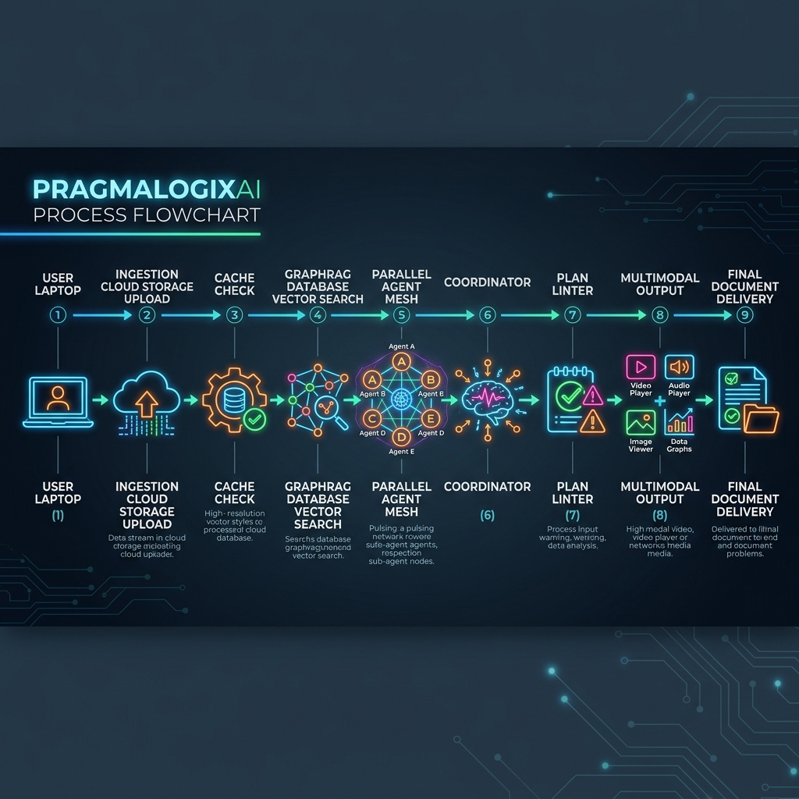
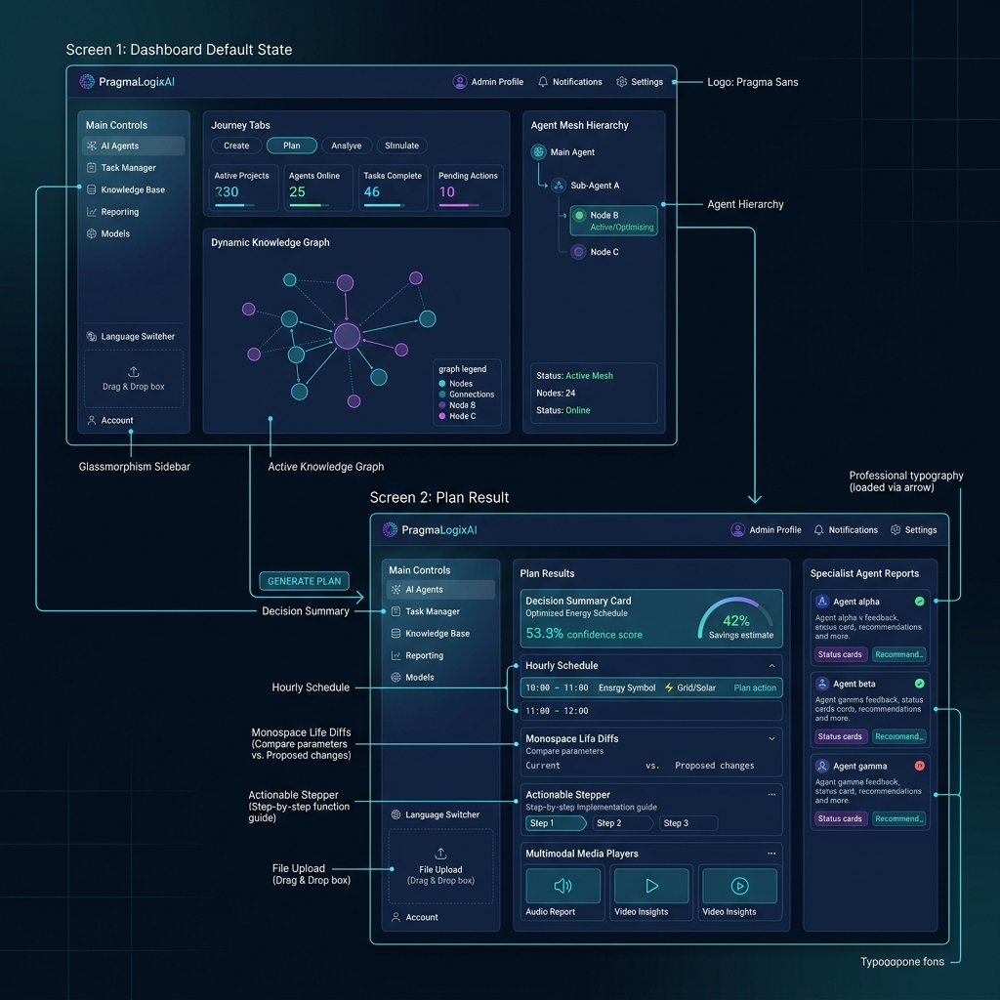

# PragmaLogixAI — System Architecture & Design Diagrams

This document contains professional, high-resolution illustrative diagrams detailing the hosting infrastructure, application logic, processing pipeline, and user interface layouts for PragmaLogixAI.

---

## 1. Google Cloud Infrastructure Architecture

This diagram illustrates how user requests route from the client browser through the Google Cloud network and interact with serverless runtimes, relational/columnar data stores, and Vertex AI models using secure Application Default Credentials (ADC).

* **Firebase Hosting CDN:** Caches static Next.js assets globally and handles secure SSL termination.
* **Serverless Cloud Run:** Both frontend and backend automatically scale to zero when idle, saving cost.
* **Secret Manager:** Credentials like the PostgreSQL connection string are injected at runtime; no secrets are stored in code.
* **Application Default Credentials (ADC):** Authorization to Vertex AI services is handled via IAM roles bound to the Cloud Run service account, eliminating API keys.

---

## 2. Detailed Solution Architecture (Illustrative 3D Concept)

This comprehensive illustrative diagram shows the entire solution stack: frontend dashboard integration, Secret Manager credentials, active data resources (pgvector Cloud SQL, BigQuery, GCS), and the multi-agent orchestration layer connected to Google Vertex AI.

* **Illustrative Stack:** Highlights the client-to-API-to-database interfaces using clean, professional 3D technical icons.
* **Orchestration Connectors:** Represents how each independent agent connects to the central LLM engine and databases.
* **Vertex AI Integration:** Illustrates the direct IAM role-based connections to Gemini, Imagen, Chirp, and Veo APIs.

---

## 3. Application Flow & Multi-Agent Mesh

This diagram illustrates how an ingested life signal (text, audio, image, or video) triggers GraphRAG retrieval, parallel execution of five specialist agents, and coordinator-led synthesis with linter checking and multimodal output generation.

* **asyncio.gather Parallelism:** Reduces latency by running all 5 domain agents concurrently in a single event loop.
* **GraphRAG Grounding:** Every specialist agent receives a personalized history context from the Life Knowledge Graph, avoiding generic prompts.
* **Plan Linter:** Validates energy budgets and schedule overlaps, functioning as a "compiler" for the synthesized JSON.
* **Semantic Plan Cache:** Checks incoming query hashes; on hit, it returns the cached plan instantly to save Vertex AI token usage.

---

## 4. Horizontal Process Flow (with Colorful Icons)

This process map displays the step-by-step pipeline from user input to multimodal outcome delivery, laid out horizontally with vibrant, colorful concept icons for readability (representing Slide 6).

* **Step 1 (Laptop Icon):** User inputs details, selects profile and language, and submits signal.
* **Step 2 (Cloud Ingest Icon):** File stages to Cloud Storage; Gemini extracts nodes/edges.
* **Step 3 (Cache Gear Icon):** Semantic cache checks for previous matching requests.
* **Step 4 (Database Icon):** pgvector similarity search returns top-5 graph context nodes.
* **Step 5 (Specialist Mesh Icon):** 5 domain-expert agents run concurrently in a thread group.
* **Step 6 (Brain Icon):** Gemini 2.5 Pro Coordinator merges reports into a structured plan.
* **Step 7 (Warning Icon):** Energy cost linter checks schedule parameters.
* **Step 8 (Media Player Icon):** Multimodal services generate Imagen, Chirp audio, and Veo video.
* **Step 9 (Document Delivery Icon):** Complete plan package delivered dynamically in the selected language.

---

## 5. User Flow & Wireframe Layouts

This mockup captures the visual layouts and interface placement of both the default dashboard state and the generated plan layout (representing Slide 7).

* **Screen 1 — Dashboard (Default):** 3-column layout. Left Sidebar contains lang/profile switcher, Center Panel contains KPIs & suggestion templates, and Right Panel visualizes the live ADK agent mesh stream.
* **Screen 2 — Plan Result:** Renders the customized hourly schedule with color-coded energy cost ratings (⚡1-5), Aider-style green/red changes (+ / -), stepper roadmap, inline audio/video players, and expandable agent logs.
